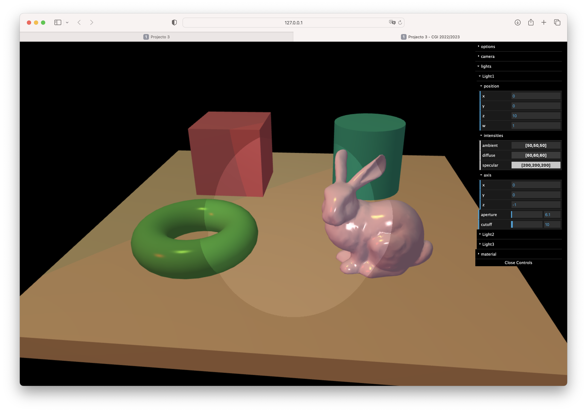
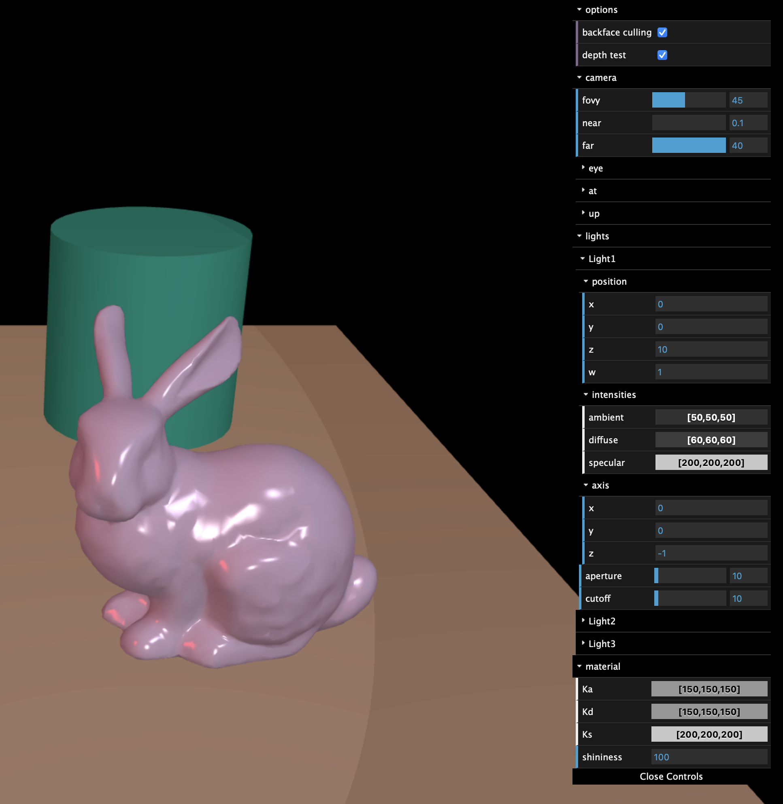
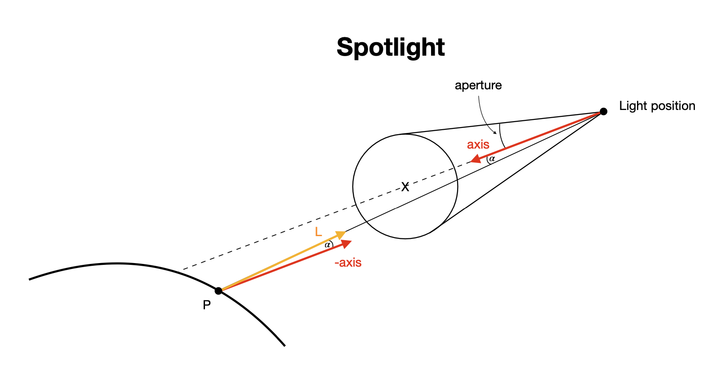

# Project 3 — 3Illumination and Shading
Version 1.0

## Change Log
- 19/11/2025, minor corrections and rewriting of the challenges section.
- 18/11/2025, Initial version published.
---


## Objective

In this project, we will create an application that allows objects to be viewed under the effect of light sources, using a camera with a perspective projection. The viewer should occupy the entire browser window.


The lighting of objects will be implemented using the Phong lighting model, evaluated in the camera reference frame. Lighting can be calculated at the level of each fragment (Phong shading) or each vertex (Gouraud shading).

The scene consists of:

- a parallelepiped platform measuring 10 x 0.5 x 10 (in WC), aligned with the world axes and with its upper face at $y=0$. 
- 4 primitive objects, from those provided in the libs folder, placed on top of the platform and centred in each of the quadrants. You can use a 2 x 2 x 2 cube as a reference for their size. The Bunny object should be in one of the quadrants.
- 1 to 3 lights controlled by the user using an interface implemented using the dat.gui library.

## Other Features

The user can also:

- enable/disable the hidden face removal method known as the internal product method (or back face culling);
- enable/disable the hidden face removal method known as z-buffer (or depth buffer);
- choose between Phong and Gouraud shading (not visible in the screenshots here)
- change the characteristics of the material ($\mathbf K_a$, $\mathbf K_d$, $\mathbf K_s$ and ${shininess}$) applied to the Bunny object, with the materials of the other objects in the scene being different, but without the need for them to be parameterised by the user;
- each light source can be turned on/off, parameterised to be point, directional or spotlight type. If it is point light, the user can control its position in the scene (in Camera Coordinates). If it is directional, the user can define the direction of the light emitted (travelling direction of the respective photons);
- the spectral signature of each light source should also be modifiable (r, g and b intensities for each of the terms of the lighting model - ambient, diffuse and specular)
- manipulate the position and orientation of the camera, simply using sliders as an interface to manipulate eye, at and up.
- manipulate the viewing volume of the perspective projection (fovy, near and far). Note that aspect should be a function of the relative dimensions of the viewport.

**Note**: If it supports more than one light source, its interface should be created in such a way that adding a new light source to your program will simply result in adding another object (with the properties of the light source) to a vector that stores all the lights in the scene.

The following image shows (partially) a possible interface for the program. Note that the interface shown does not scale well with the number of light sources, but this is not a problem that concerns us in this work.



The interface also shows the parameters of the material associated with the Bunny material. Note that a scale from 0 to 255 is used for each component of the $\mathbf K_a$, $\mathbf K_d$ and $\mathbf K_s$ parameters. This is because the `dat.gui` library uses these ranges to represent colour components. We suggest passing values between 0 and 255 to the shaders, rather than normalised values between 0 and 1.

## Window resizing

The user can change the dimensions of the browser window, causing the aspect ratio to change. The aspect ratio of the camera will be exactly the same as that of the browser window. For this reason, there is no need to display the aspect parameter of the perspective camera in the interface.

## Spotlights

The following image shows a spotlight-type light. 



In addition to a position, it also has:

- a central direction that defines where the light points (axis)
an aperture angle that defines a conical region in space (specified in degrees)
- a decay parameter (cutoff) that attenuates the intensity of the light as we move away from the central direction.

The attenuation of intensity as a function of distance from the central direction can be given by:

$ {\cos (\alpha)}^\eta $, where $\alpha$ is the angle formed between the vector $\mathbf{L}$ and the vector $ -\mathbf{{axis}}$, and $\eta$ is the cutoff parameter.

## Program limits and technical specifications

The maximum number of lights supported by your program must be a constant that should only appear in two places in your code, specifically in the application's JavaScript file and in the GLSL program's shader(s) responsible for lighting.

We suggest including the following declarations in the fragment shader:
```
const int MAX_LIGHTS = 8;

struct LightInfo {
    // Light colour intensities
    vec3 ambient;
    vec3 diffuse;
    vec3 specular;

    // Light geometry
    vec4 position;  // Position/direction of light (in camera coordinates)
    // ...
    //   additional fields
    // ...
};

struct MaterialInfo {
    vec3 Ka;
    vec3 Kd;
    vec3 Ks;
    float shininess;
};

uniform int u_n_lights; // Effective number of lights used

uniform LightInfo u_lights[MAX_LIGHTS]; // The array of lights present in the scene
uniform MaterialInfo u_material;        // The material of the object being drawn
```

Note the grouping of several uniform variables in structures. On the JavaScript side, we can pass values to these uniform structures field by field, using their names. For example, we can write:

```
const u_shininess = gl.getUniformLocation(program, "u_material.shininess");
const u_KaOfLight0 = gl.getUniformLocation(program, "u_lights[0].ambient");
```

Those who choose to implement only one light source should replace the uLights array in the example above with a single variable. However, implementing multiple lights will be appreciated, as well as the ease of adding them, changing the application code as little as possible.

The lighting model to be implemented is the Phong model, as presented here:
$$
\mathbf{I} = \sum_{l=1}^{L} \mathbf{I}_{a,l} \mathbf{K}_a + f_{{att},l} \mathbf{I}_{p,l} \left[ \mathbf K_d ( \mathbf{N} \cdot \mathbf{L} )^+ + \mathbf{K}_s {( \mathbf{R} \cdot \mathbf{V})^+}^n\right ]
$$

## Possible Challenges

- Have the possibility to specify lights in the world coordinate system instead of the camera coordinate system. This should be handled by the javascript side of your application. The shaders would still receive light positions/directions in camera coordinates.
- Implement the typical controls for looking around (using the mouse) and flying (using `w` `a` `s` `d` keys). Don't forget to include a key to reset the camera to its initial state.
